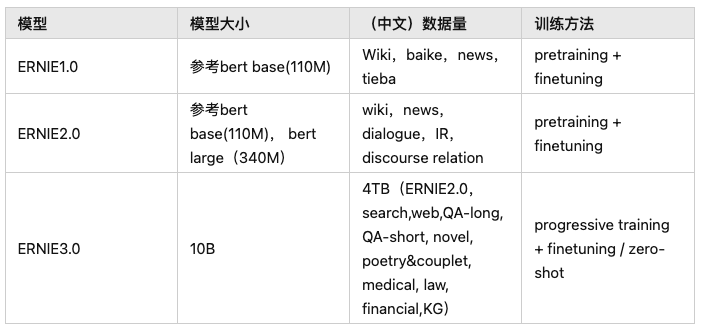
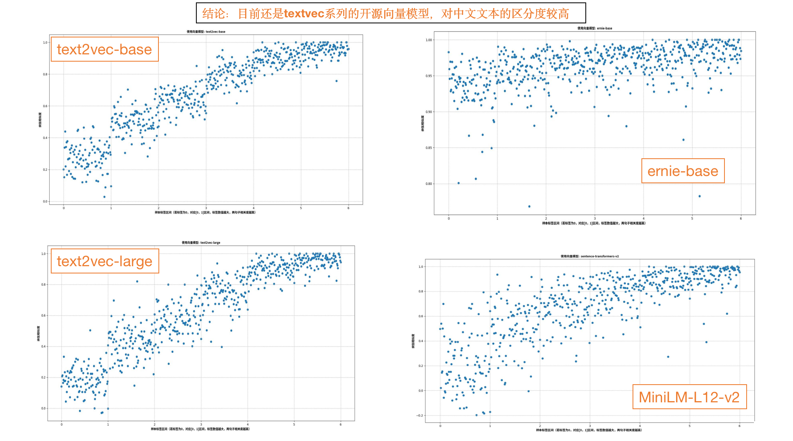
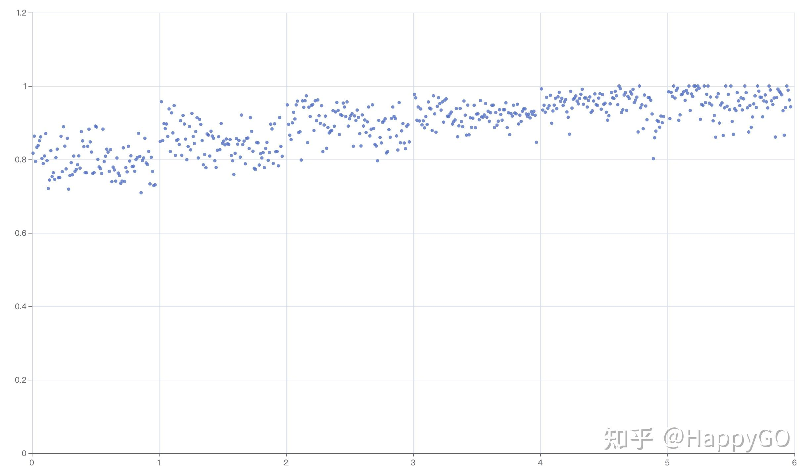

# 基于开源embedding模型的中文向量效果测试

## 一、调研资料
### 1、概念
1. embedding方法分类为：word2vec（基于seq2seq的神经网络结构）、Glove（词共现矩阵）、Item2Vec（推荐中的双塔模型）、FastText（浅层神经网络）、ELMo（独立训练双向，stacked Bi-LSTM架构）、GPT（从左到右的单向Transformer）、BERT（双向transformer的encoder，attention联合上下文双向训练）
2. 参考资料：
   - ****[fastText/elmo/bert对比](https://zhuanlan.zhihu.com/p/67099007)****
   - ****[word2vector 以及GloVe详解](https://zhuanlan.zhihu.com/p/94082050)****
   - ****[BERT模型入门系列（五）:Bert、ElMo、GPT模型原理](https://zhuanlan.zhihu.com/p/361441189)****
  

### 2、开源模型
1. Text2vec文本表征及相似度计算：包括text2vec-large-chinese（LERT，升级版）、base（CoSENT方法训练，MacBERT）两个模型。这个模型也使用了word2vec（基于腾讯的800万中文词训练）、[SBERT(Sentence-BERT)](https://github.com/shibing624/text2vec/blob/master/text2vec/sentencebert_model.py)、[CoSENT(Cosine Sentence)](https://github.com/shibing624/text2vec/blob/master/text2vec/cosent_model.py)三种表示方法训练
2. OpenAI的Embeddings：这是OpenAI官方发布的Embeddings的API接口。目前有2代产品。目前主要是第二代模型：`text-embedding-ada-002`。它最长的输入是8191个tokens，输出的维度是1536
3. 百度的ernie-3.0-base-zh：https://github.com/PaddlePaddle/PaddleNLP、**[ERNIE三个版本进化史](https://zhuanlan.zhihu.com/p/523727481)**
4. SimCSE：https://github.com/princeton-nlp/SimCSE
5. 其他模型：[embedding模型 · 魔搭社区](https://modelscope.cn/models?page=1&tasks=sentence-embedding&type=nlp)


### 3、论文集合（时间线从旧到新）
  - Sentence-Bert：[Sentence-Bert论文笔记](https://zhuanlan.zhihu.com/p/113133510)
  - Bert-Flow：[On the Sentence Embeddings from Pre-trained Language Models](https://link.zhihu.com/?target=https%3A//arxiv.org/abs/2011.05864)
  - BERT-whitening：****[Whitening Sentence Representations for Better Semantics and Faster Retrieval](https://arxiv.org/abs/2103.15316)****
  - ConSERT：[ConSERT: A Contrastive Framework](https://link.zhihu.com/?target=https%3A//arxiv.org/abs/2105.11741)
  - SimCSE：[SimCSE论文精读](https://zhuanlan.zhihu.com/p/452761704)
  - ESimCSE：[ESimCSE: Enhanced Sample Building Method](https://link.zhihu.com/?target=https%3A//arxiv.org/abs/2109.04380)
  - PromptBERT：[PromptBERT: Improving BERT](https://link.zhihu.com/?target=https%3A//arxiv.org/abs/2201.04337)
  - OpenAI：[基于对比学习的预训练文本&代码表征技术](https://zhuanlan.zhihu.com/p/469474178)
  - SNCSE：[基于软负例的无监督句向量对比学习方法](https://zhuanlan.zhihu.com/p/463142612)
  - DiffCSE：[结合句子间差异的无监督句子嵌入对比学习方法](https://zhuanlan.zhihu.com/p/507171467)
  - EASE：[融合实体信息的句子嵌入对比学习方法](https://zhuanlan.zhihu.com/p/515964126)
  - 论文列表：https://github.com/Doragd/Awesome-Sentence-Embedding


## 二、模型测试
### 1、测试方案参考
  - **[中文Sentence Embeddings *text2vec*-base-chinese VS OpenAIEmbedding](https://zhuanlan.zhihu.com/p/623912895)**


### 2、对比模型
  1. [GanymedeNil/text2vec-large-chinese](https://huggingface.co/GanymedeNil/text2vec-large-chinese/tree/main)：约占用显存 3GB，可修改为CPU中运行。基于CoSENT方法训练，将MacBERT替换为LERT，其他训练条件不变
  2. [shibing624/text2vec-base-chinese](https://huggingface.co/shibing624/text2vec-base-chinese)：属于余弦句子模型，基于CoSENT方法训练，使用MacBERT ，它将句子映射到768维的密集向量空间，可用于句子嵌入、文本匹配或语义搜索等任务。
  3. [nghuyong/ernie-3.0-base-zh](https://huggingface.co/nghuyong/ernie-3.0-base-zh)：模型结构增加Universal和Task-specific的表征模块，新增了knowledge-aware的预训练任务，同时数据量增加到10B
      
      
      
  4. [paraphrase-multilingual-MiniLM-L12-v2](https://huggingface.co/sentence-transformers/paraphrase-multilingual-MiniLM-L12-v2/tree/main)：该模型将句子映射到384维的稠密向量空间中，可用于聚类或语义搜索等任务，是 sentence_transformers 库的模型之一。
  5. openai-embedding：是OpenAI官方发布的Embeddings的API接口。目前有2代产品。目前主要是第二代模型：`text-embedding-ada-002`。它最长的输入是8191个tokens，输出的维度是1536。


### 3、对比结果
1. 数据说明：
   - 基于**STS-B**数据集进行测试：该数据集通过翻译加部分人工修正的方法，从英文原数据集生成，可以一定程度上缓解中文语义相似度计算数据集不够的问题。每条数据包含三列，分别表示 sentence1、sentence2 和相似等级（Label），相似等级范围为 0~5，**5 表示语义一致，0 表示语义不相关**
   - 测试集选取原则：从**STS-B**数据的训练集当中，对0-5共6个类别进行随机抽样100个样本，得到600个样本。
   - 样例：
       
       ```shell
       齐默曼回答说：“你在这里做什么？”	马丁说：“你为什么跟踪我？”	0
       那只棕色的大狗在高高的草地上跳来跳去。	那个穿着蓝色衬衫的女孩正在穿过一个科学中心。	0
       世界上的每一个人都达到了墨西哥目前的繁荣水平。	世界上的每一个人都处在目前西北非洲的“繁荣”水平。	1
       巴勒斯坦和约旦协调和平谈判立场	哈马斯高级否认加沙，巴权力机构协调和谈	1
       许多人参加了自行车比赛，包括一名骑三轮自行车的人。	一个坐着三轮椅的人。	2
       海啸警报：南澳无需恐慌	亚齐地震后的海啸警报	2
       抓着金属门的鸟。	一只五颜六色的鸟依附在铁丝网上。	3
       锡箔帽为狗脸，你穿多大的尺寸？	锡箔帽给萨格，你穿多大尺寸的？	3
       阿肯色州最高法院否决行刑法	阿肯色州法官废除死刑	4
       一只松鼠在转圈。	一只松鼠绕着圈跑。	4
       一列玩具火车撞上了一辆玩具汽车。	一列玩具火车撞上了一辆玩具汽车。	5
       一个人走下楼梯。	一个男人走下楼梯。	5
       ```
       
2. 模型测试：选取【text2vec-base、text2vec-large、ernie-base】三个模型，输入每个样本每句话，输出句向量，然后对每条样本的两个句向量计算余弦相似度（cosine similarity），值域为[-1, 1]。最后画成效果图，**x轴是Label，y轴是model的cosine similarity**，并让点可以散开，如果Label是0就把x平均分布到0~1之间，是1就把x平均分布到1~2之间，以此类推；
   - 运行代码：
        ```shell
        # 先将模型下载到models文件夹中，并修改test.py中的模型路径
        # 运行
        python test.py
        ```
3. 对比结论：
   - 开源模型：建议使用text2vec-base模型，另外魔搭社区里也有一些专用领域的开源模型可以选用
       
       
       
   - openai-embedding——付费接口（参考知乎博主HappyGo结果）
       
       
